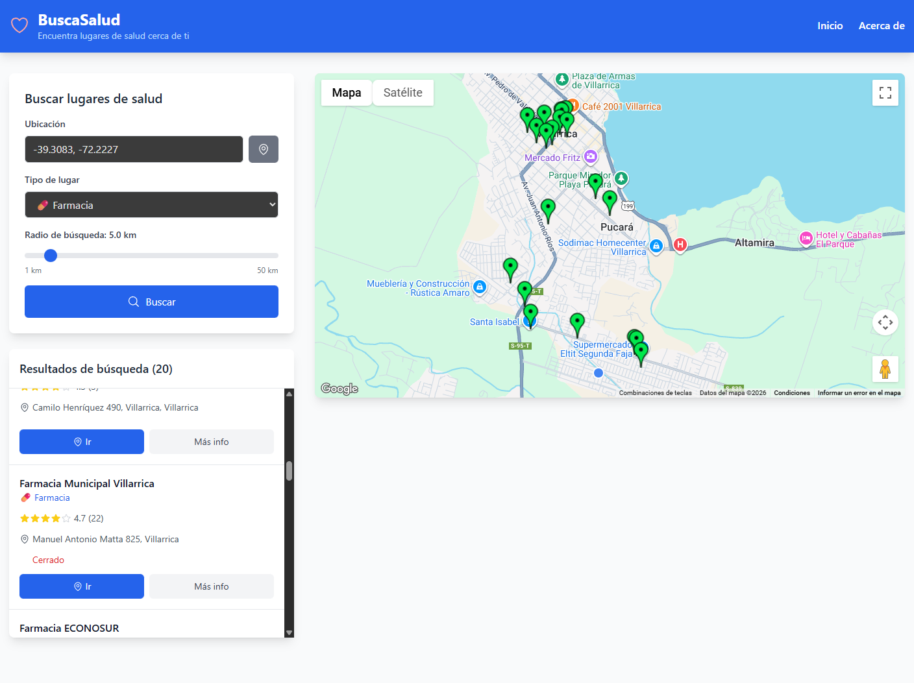

# 🏥 BuscaSalud - Aplicación Web de Lugares de Salud

BuscaSalud es una aplicación web que permite encontrar fácilmente lugares de salud (farmacias, hospitales, clínicas, consultorios médicos, etc.) cerca de cualquier ubicación utilizando la API de Google Maps Places.



## 🚀 Características

- **Búsqueda por ubicación**: Encuentra lugares de salud cerca de cualquier dirección
- **Múltiples tipos de lugares**: Farmacias, hospitales, clínicas, dentistas, fisioterapeutas y veterinarias
- **Mapa interactivo**: Visualiza los resultados en Google Maps con marcadores personalizados
- **Información detallada**: Horarios, teléfonos, calificaciones, y enlaces para navegación
- **Interfaz responsive**: Funciona perfecto en móviles y escritorio
- **Arquitectura separada**: Backend Flask con API REST y frontend React

## 🏗️ Arquitectura del Proyecto

```
buscaSalud/
├── backend/                 # API Flask con patrón MVC
│   ├── src/
│   │   ├── controllers/    # Controladores de la API
│   │   ├── services/       # Lógica de negocio
│   │   ├── models/         # Modelos de datos
│   │   └── utils/          # Utilidades y validadores
│   ├── requirements.txt
│   └── app.py
├── frontend/               # Aplicación React con Vite
│   ├── src/
│   │   ├── components/     # Componentes React
│   │   ├── utils/          # Utilidades del frontend
│   │   └── App.jsx
│   └── package.json
└── README.md
```

## 🛠️ Instalación y Configuración

### Prerrequisitos

- Python 3.8+
- Node.js 16+
- Clave API de Google Maps con las siguientes APIs habilitadas:
  - Maps JavaScript API
  - Places API
  - Geocoding API

### 1. Obtener API Key de Google Maps

1. Ve a **[Google Cloud Console](https://console.cloud.google.com/)**
2. **Inicia sesión** con tu cuenta de Google (Gmail)
3. **Acepta los términos** (es gratis, no requiere tarjeta de crédito para APIs básicas)

### **2. Crear nuevo proyecto**
1. En la parte superior, haz clic en **"Seleccionar proyecto"**
2. Haz clic en **"PROYECTO NUEVO"**
3. **Nombre del proyecto**: `BuscaSalud` (o el que prefieras)
4. Haz clic en **"CREAR"**
5. **Espera** que se cree (30-60 segundos)

### **3. Habilitar las APIs necesarias**
1. En el menú lateral, ve a **"APIs y servicios" → "Biblioteca"**
2. **Busca y habilita estas 3 APIs** (haz clic en cada una y luego "HABILITAR"):
   - **"Maps JavaScript API"** 
   - **"Places API"**
   - **"Geocoding API"**

### **4. Crear tu API Key**
1. Ve a **"APIs y servicios" → "Credenciales"**
2. Haz clic en **"+ CREAR CREDENCIALES"**
3. Selecciona **"Clave de API"**
4. **¡COPIA tu API Key!** (algo como: `AIzaSyB...`)

### **5. Configurar restricciones (IMPORTANTE)**

**⚠️ Para que funcione tu aplicación, elige UNA de estas opciones:**

#### **Opción A: Sin restricciones (Desarrollo - FÁCIL)**
1. Haz clic en el **lápiz** (editar) junto a tu API Key
2. En **"Restricciones de la aplicación"**: Selecciona **"Ninguna"**
3. Haz clic en **"GUARDAR"**

#### **Opción B: Restricciones de IP (Recomendado)**
1. En **"Restricciones de la aplicación"**: Selecciona **"Direcciones IP"**
2. Añade estas IPs:
   - `127.0.0.1` (localhost)
   - `192.168.1.0/24` (tu red local)
3. En **"Restricciones de API"**: Marca las 3 APIs que habilitaste
4. Haz clic en **"GUARDAR"**

#### **Opción C: Dos API Keys separadas (Mejor práctica)**
1. **Crea una segunda API Key** para el backend (sin restricciones)
2. **Usa la primera** para el frontend (con restricciones de HTTP)

### **💰 Costos - ¡COMPLETAMENTE GRATIS!**
- **$200 USD de crédito gratuito mensual para siempre**
- **28,500+ cargas de mapa gratuitas por mes**
- **100,000+ búsquedas de lugares gratuitas por mes**
- **Tu aplicación puede funcionar AÑOS sin costo**

### 2. Configurar Backend

```bash
# Navegar a la carpeta del proyecto
cd buscaSalud

# Crear entorno virtual
python -m venv venv

# Activar entorno virtual
# En Windows:
venv\Scripts\activate
# En macOS/Linux:
source venv/bin/activate

# Navegar al backend
cd backend

# Instalar dependencias
pip install -r requirements.txt

# Crear archivo .env (copia desde .env.example)
copy .env.example .env

# Editar .env y añadir tu API key:
# GOOGLE_MAPS_API_KEY=AIzaSyB_tu-api-key-aqui
# SECRET_KEY=clave-generada-automaticamente
# FLASK_ENV=development
```

### **⚠️ Solución a errores comunes:**

#### **Error: "REQUEST_DENIED - API keys with referer restrictions"**
- **Causa**: Tu API Key tiene restricciones de referenciador
- **Solución**: Ve a Google Cloud Console → Credenciales → Editar tu API Key → Restricciones: "Ninguna" o usa "Direcciones IP"

#### **Error: "API not enabled"**
- **Causa**: No habilitaste todas las APIs necesarias
- **Solución**: Ve a "Biblioteca" y habilita: Maps JavaScript API, Places API, Geocoding API

### 3. Configurar Frontend

```bash
# En una nueva terminal, navegar al frontend
cd frontend

# Instalar dependencias
npm install

# Crear archivo .env (copia desde .env.example)
copy .env.example .env

# Editar .env y añadir tu API key:
# VITE_GOOGLE_MAPS_API_KEY=AIzaSyB_tu-misma-api-key
# VITE_API_BASE_URL=http://localhost:5000
```

### **⚠️ Problemas comunes del Frontend:**

#### **Error: "Google Maps JavaScript API error"**
- **Causa**: API Key incorrecta o restricciones mal configuradas
- **Solución**: Verifica que la API Key sea la misma que funciona en el backend

#### **Error: "CORS policy blocked"**
- **Causa**: Backend no está ejecutándose
- **Solución**: Asegúrate que el backend esté corriendo en http://localhost:5000

## 🚀 Ejecutar la Aplicación

### Ejecutar Backend (Terminal 1)

```bash
# Activar entorno virtual
venv\Scripts\activate

# Ir al backend y ejecutar
cd backend
python app.py
```

✅ **Backend disponible en:** http://localhost:5000

### Ejecutar Frontend (Terminal 2)

```bash
cd frontend
npm run dev
```

✅ **Frontend disponible en:** http://localhost:5173

## 🚨 **Solución de Problemas**

### **❌ Error: "REQUEST_DENIED"**
```
Error de Google Maps API: REQUEST_DENIED (API keys with referer restrictions cannot be used with this API.)
```

**Solución:**
1. Ve a **Google Cloud Console → Credenciales**
2. **Edita tu API Key**
3. En **"Restricciones"**: Cambia a **"Ninguna"** o **"Direcciones IP"**
4. **Espera 1-2 minutos** y reinicia el backend

### **❌ Error: "ModuleNotFoundError: googlemaps"**
```bash
# Asegúrate de activar el entorno virtual:
venv\Scripts\activate
cd backend
pip install -r requirements.txt
```

### **❌ Frontend no se conecta al Backend**
- Verifica que el backend esté corriendo en http://localhost:5000
- Revisa que el archivo frontend/.env tenga: `VITE_API_BASE_URL=http://localhost:5000`

### **❌ Mapa no carga**
- Verifica tu API Key en frontend/.env
- Asegúrate de haber habilitado "Maps JavaScript API" en Google Cloud

## 📚 Uso de la Aplicación

1. **Buscar ubicación**: Introduce una dirección, ciudad o usa tu ubicación actual
2. **Seleccionar tipo**: Elige el tipo de lugar de salud (farmacia, hospital, etc.)
3. **Ajustar radio**: Define el radio de búsqueda (1-50 km)
4. **Ver resultados**: Los resultados aparecen en la lista y en el mapa
5. **Obtener direcciones**: Haz clic en "Ir" para abrir navegación en Google Maps

## 🔧 API Endpoints

### Buscar lugares de salud
```
GET /api/search?location={ubicacion}&type={tipo}&radius={radio}
```

### Obtener detalles de un lugar
```
GET /api/place/{place_id}
```

### Verificar salud de la API
```
GET /api/health
```

## 🎨 Componentes Frontend

- **App.jsx**: Componente principal con estado global
- **Header.jsx**: Barra de navegación
- **SearchForm.jsx**: Formulario de búsqueda con filtros
- **MapContainer.jsx**: Integración con Google Maps
- **ResultsList.jsx**: Lista de resultados con información detallada
- **LoadingSpinner.jsx**: Indicador de carga

## �️ **Seguridad y Mejores Prácticas**

### **🔑 Gestión de API Keys**
- **Desarrollo**: Usa restricciones "Ninguna" o "Direcciones IP"
- **Producción**: Siempre usa restricciones de dominio/IP
- **Nunca** subas archivos `.env` a GitHub (ya están en .gitignore)

### **🚀 Deploy en Producción**
- **Backend**: Usa Heroku, Railway, o DigitalOcean
- **Frontend**: Usa Vercel, Netlify, o GitHub Pages
- **Variables de entorno**: Configura en la plataforma de deploy

### **📊 Monitoreo de Uso**
- Ve a Google Cloud Console → "APIs y servicios" → "Panel de control"
- Revisa tu uso mensual para asegurarte de mantenerte en el tier gratuito

## 🛠️ Tecnologías Utilizadas

### Backend
- **Flask**: Framework web de Python
- **googlemaps**: Cliente oficial de Google Maps para Python
- **python-dotenv**: Gestión de variables de entorno
- **flask-cors**: Manejo de CORS

### Frontend
- **React**: Biblioteca de JavaScript para interfaces de usuario
- **Vite**: Build tool y servidor de desarrollo
- **Tailwind CSS**: Framework de CSS utilitario
- **Heroicons**: Iconos SVG para React

## 🤝 **Contribuir**

1. Fork del repositorio
2. Crea una rama para tu feature (`git checkout -b feature/nueva-funcionalidad`)
3. Commit tus cambios (`git commit -am 'Añade nueva funcionalidad'`)
4. Push a la rama (`git push origin feature/nueva-funcionalidad`)
5. Abre un Pull Request

## 📞 **Soporte**

### **🐛 ¿Tienes problemas?**
1. **Revisa la sección "Solución de Problemas"** arriba
2. **Verifica tu configuración** de Google Cloud Console
3. **Asegúrate** de que ambos servidores estén corriendo
4. **Revisa la consola** del navegador para errores de JavaScript

### **📋 Checklist de diagnóstico:**
- [ ] ¿Tienes las 3 APIs habilitadas en Google Cloud?
- [ ] ¿Tu API Key está configurada sin restricciones o con IP?
- [ ] ¿El backend muestra "Running on http://127.0.0.1:5000"?
- [ ] ¿El frontend muestra "Local: http://localhost:5173/"?
- [ ] ¿Los archivos .env tienen la misma API Key?

## 📝 **Licencia**

Este proyecto está bajo la Licencia MIT.

## 👨‍💻 **Desarrollado por**

**David** - 2026

---

### 🎯 **Características Principales**
- ✅ **Búsqueda inteligente** por ubicación y tipo
- ✅ **Mapa interactivo** con marcadores personalizados  
- ✅ **Información completa** (horarios, teléfonos, ratings)
- ✅ **Geolocalización automática**
- ✅ **Interfaz responsive** (móvil y escritorio)
- ✅ **Navegación directa** a Google Maps
- ✅ **API REST completa** con arquitectura MVC

### 🔥 **¿Necesitas ayuda?** 
Abre un issue en el repositorio o contacta al desarrollador.

**¡Disfruta encontrando lugares de salud cerca de ti! 🏥💊**